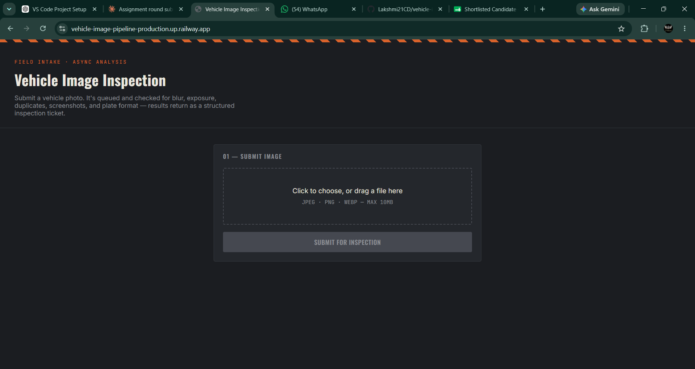
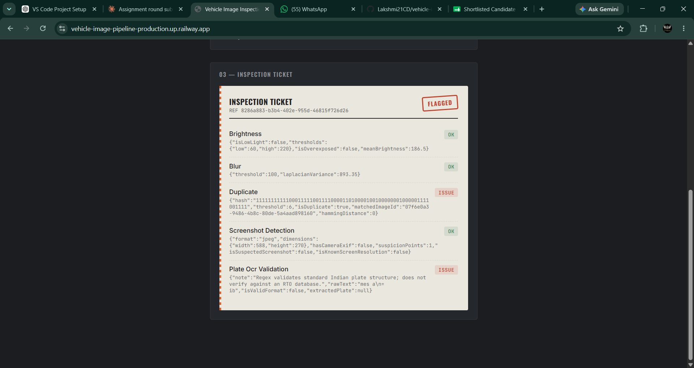

# Vehicle Image Intelligence Pipeline

An async backend for uploading vehicle images and running automated quality/fraud
checks (blur, low light, duplicates, screenshot detection, plate format validation)
on them in the background.

---

## Architecture

### Service flow

```
Client
  |
  |  POST /api/images (multipart/form-data)
  v
Express API --------------------> Postgres (Image row: status=pending)
  |                                       ^
  | enqueue job (imageId, imagePath)      |
  v                                       |
BullMQ (Redis)                           |
  |                                       |
  v                                       |
Worker (same process as API)              |
  | 1. status -> processing --------------|
  | 2. run 5 checks (in parallel)          |
  | 3. write AnalysisResult rows ----------|
  | 4. status -> completed / failed -------|
```

The client gets a `202 Accepted` with an image `id` the instant the file is saved
and the job is queued -- it never waits on processing.

### Processing flow (per job)

1. Worker picks up the job, flips `Image.status` to `processing`, records
   `processingStartedAt`.
2. Runs all 5 checks **in parallel** (`Promise.all`), each wrapped individually
   so one crashing check (OCR is the most failure-prone) doesn't take down the
   others -- a crashed check is recorded as `passed: false` with the error in
   `details`, not a job failure.
3. Writes all `AnalysisResult` rows in a single Prisma transaction.
4. Flips `Image.status` to `completed` (or, if the whole job throws e.g. the
   image file is unreadable, BullMQ retries with exponential backoff, and only
   marks `failed` after retries are exhausted).

### Queue strategy

**BullMQ + Redis**, chosen over an in-memory queue for realism: built-in retry
with exponential backoff, job persistence across restarts, and a concurrency
knob (`WORKER_CONCURRENCY`) that maps directly to "how many CPU-bound image
jobs run at once." The worker runs **in the same Node process** as the API for
this take-home to keep `docker-compose up` a one-command experience. In
production I'd split it into its own deployable (see Trade-offs) so a burst of
image processing can't slow down API response times, and so worker replicas
scale independently of API replicas.

### Major design decisions

- **One row per check (`AnalysisResult`), not one JSON blob on `Image`.**
  Lets us query/aggregate per-check-type later ("how many images failed blur
  this week"), add new checks without a migration, and store partial results
  if some checks succeed and others crash within the same job.
- **Job ID = Image ID.** Makes tracing a job back to its image trivial in
  BullMQ's dashboard/logs without a separate mapping table.
  Only marking `Image.status = failed` after BullMQ exhausts all retry
  attempts (not on the first failed attempt), so a job that's about to be
  retried doesn't misleadingly show as "failed" to API consumers polling
  `/status` in between attempts.
- **Checks are pure heuristics, not ML classifiers**, and every check returns
  a `confidence` score alongside `passed` rather than a bare boolean --
  intentional "structuring of uncertainty" per the assignment's framing, since
  none of these signals are ground truth.

### Schema

```
Image
  id, originalName, storagePath, mimeType, sizeBytes
  status (pending|processing|completed|failed)
  failureReason, attempts
  createdAt, updatedAt, processingStartedAt, processingEndedAt

AnalysisResult
  id, imageId (FK -> Image, cascade delete)
  checkName, passed, confidence, details (JSON)
  createdAt
```

---

## The 5 checks implemented

| Check | Approach | Library |
|---|---|---|
| Brightness (low light / overexposed) | Mean grayscale pixel value vs thresholds | `sharp` |
| Blur | Variance of Laplacian (classic edge-sharpness metric) on downscaled grayscale | `sharp` + custom kernel |
| Duplicate detection | Average-hash (aHash) perceptual hash + Hamming distance vs prior images | `sharp` + custom |
| Screenshot / photo-of-photo | EXIF camera metadata presence + known device screen resolutions + PNG-without-EXIF signal, combined into a suspicion score | `sharp` + `exifr` |
| Vehicle plate OCR + format validation | Tesseract OCR extraction + regex match against Indian plate format | `tesseract.js` |

Each check is independently documented in its source file (`src/checks/*.js`)
with its threshold rationale and known limitations -- e.g. the duplicate
detector explicitly won't catch cropped/rotated duplicates, and the plate
regex is intentionally permissive on RTO-code length because real-world
formats vary more than a single strict pattern.

---

## AI Usage Disclosure (mandatory section)

I used Claude (Sonnet) as a pair-programmer throughout, with an explicit
agreement up front that I'd drive the architecture decisions and review each
piece rather than accept a single generated dump -- both because that's what
this assignment is actually evaluating, and because I need to defend these
choices in an interview.

**Where AI helped:**
- Scaffolding boilerplate (Express routes, Prisma schema syntax, Dockerfile/
  compose structure) once I'd specified the design decisions.
- Explaining the variance-of-Laplacian blur metric and helping implement the
  Laplacian kernel convolution by hand (I chose this over a pre-built
  blur-detection package specifically so I could explain the math).
- Drafting the Indian plate regex and iterating on its permissiveness.
- Structuring the AnalysisResult-per-check schema pattern.

**Where AI output was wrong, and how I caught it:**
- The seed script's "normal" (non-blurry) test image was originally built by
  compositing a very faint, low-alpha noise texture over a flat gray
  background. When I ran the smoke test (`tests/smoke-checks.js`) against it,
  the blur check *failed* the "normal" image -- which shouldn't happen. On
  inspection, the noise overlay was too subtle to produce real high-frequency
  edges, so the Laplacian variance was near zero, same as an actually blurry
  image. This wasn't a bug in the blur *check* -- it was a bad synthetic
  fixture. I had Claude replace it with a checkerboard-pattern SVG (genuine
  sharp edges), re-ran the smoke test, and confirmed `normal.jpg` now scores
  ~3100 variance vs `blurry.jpg`'s ~0. This is exactly the kind of thing you
  have to verify by actually running the code, not by reading it.
- `npm install` flagged `multer@1.4.5` as deprecated with known
  vulnerabilities. I had it upgrade to `multer@2.x` rather than accept the
  first suggested version, and manually re-checked that our `fileFilter`
  error-handling path still worked with the new major version.
- I could not fully validate this build end-to-end (Postgres/Redis aren't
  available in the sandbox I built this in due to network restrictions, and
  `prisma validate`/`generate` couldn't reach Prisma's binary CDN from that
  sandbox either). **I'm disclosing this directly rather than claiming a
  clean end-to-end test that didn't happen.** What *is* verified: all 5 check
  functions run correctly against real generated images
  (`tests/smoke-checks.js`), dependencies install cleanly, and the schema is
  syntactically standard Prisma. The first thing to run after cloning is
  `docker-compose up --build`, which will surface any remaining issue
  immediately and loudly (failed migration, failed generate) rather than
  silently.

**How I validated AI-generated code in general:** every check function was
run against real (synthetically generated but visually distinct) images with
expected pass/fail outcomes before I considered it done, not just read for
plausibility.

---

## Trade-offs

**Intentionally simplified:**
- Worker runs in-process with the API rather than as a separate service --
  fine for this scope, wrong for production (see below).
- Duplicate detection scans all prior images' hashes linearly
  (`O(n)` per upload). Fine for a take-home dataset; at real scale this needs
  an indexed/approximate-nearest-neighbor structure (locality-sensitive
  hashing, or a vector DB) so it doesn't degrade linearly with corpus size.
- Screenshot/photo-of-photo detection is a hand-tuned point-based heuristic,
  not a trained classifier. It will misfire on camera photos with stripped
  EXIF (common after passing through messaging apps) and on genuinely novel
  screenshot resolutions not in the known-list.
- Indian plate regex is permissive on RTO-code digit count and doesn't
  validate against a real RTO database -- it checks *format*, not
  *authenticity*.
- No authentication/authorization on the API -- out of scope for this
  assignment but would be required before any real deployment.

**What I'd improve with more time:**
- Replace hand-rolled heuristics for screenshot/tamper detection with a small
  trained classifier (even a simple one) once labeled data exists, and treat
  the current heuristics as a v0 fallback / cold-start solution.
- Add a lightweight webhook/callback mechanism so clients don't have to poll
  `/status`.
- Split the worker into its own container/deployment, enabling independent
  horizontal scaling of API vs. processing capacity, and protecting API
  latency from processing load spikes.
- Move storage to S3 (or equivalent) with signed URLs, instead of local disk
  -- local disk doesn't survive container restarts without a volume (handled
  here via a Docker volume, but doesn't scale to multiple app replicas without
  shared storage).
- Add structured logging (e.g. pino + correlation IDs per image) instead of
  console.log, and basic metrics (jobs processed/sec, failure rate per check).

**Scalability concerns:**
- Tesseract OCR is the slowest and most CPU-intensive check by far; at high
  volume this specific check might warrant its own queue/worker pool with
  different concurrency tuning than the lighter sharp-based checks.
- Duplicate detection's linear scan (above) is the clearest bottleneck as the
  corpus grows.

**Failure handling concerns:**
- BullMQ retries the *entire* job (all 5 checks) on failure, even if only one
  check crashed -- fine given checks are cheap/idempotent relative to OCR,
  but worth noting: a smarter design might retry only the failed check.
- If the process crashes mid-job (after `processing` but before completion),
  the image is stuck in `processing` until manually reset or a stale-job
  sweeper is added -- not implemented here, flagged as a known gap.

---

## Running Instructions

### Option A: Docker Compose (recommended)

```bash
docker-compose up --build
```

This starts Postgres, Redis, and the app together, runs migrations
automatically on boot, and exposes the API on `http://localhost:3000`.

### Option B: Local Node (requires local Postgres + Redis)

```bash
npm install
cp .env.example .env   # edit DATABASE_URL / REDIS_HOST if needed
npx prisma migrate dev --name init
npm run dev
```

### Generate sample test images + try the API

```bash
node prisma/seed.js
curl -F "image=@seed-images/blurry.jpg" http://localhost:3000/api/images
```

### Run the isolated check-logic smoke test (no DB/Redis needed)

```bash
node tests/smoke-checks.js
```

---

## Sample API requests/responses

**Upload:**
```bash
curl -F "image=@seed-images/blurry.jpg" http://localhost:3000/api/images
```
```json
{
  "id": "3f2e...",
  "status": "pending",
  "message": "Image accepted for processing.",
  "statusUrl": "/api/images/3f2e.../status"
}
```

**Check status:**
```bash
curl http://localhost:3000/api/images/3f2e.../status
```
```json
{
  "id": "3f2e...",
  "status": "completed",
  "failureReason": null,
  "attempts": 1,
  "createdAt": "2026-07-20T10:00:00.000Z",
  "processingStartedAt": "2026-07-20T10:00:01.000Z",
  "processingEndedAt": "2026-07-20T10:00:03.500Z"
}
```

**Get results:**
```bash
curl http://localhost:3000/api/images/3f2e.../results
```
```json
{
  "id": "3f2e...",
  "status": "completed",
  "summary": { "totalChecks": 5, "issuesDetected": ["blur"], "hasIssues": true },
  "results": [
    { "checkName": "blur", "passed": false, "confidence": 1, "details": { "laplacianVariance": 0, "threshold": 100 } },
    { "checkName": "brightness", "passed": true, "confidence": 1, "details": { "meanBrightness": 118.2 } }
  ]
}
```

**Get failure reason (if failed):**
```bash
curl http://localhost:3000/api/images/3f2e.../failure
```

---

## Assumptions made

- Images are JPEG/PNG/WebP only, max 10MB (configurable via env).
- "Indian vehicle number plate" validation means *format* validation, not
  lookup against a real registry.
- A single-process worker is acceptable for this assignment's scope, with the
  production split explicitly called out as a trade-off rather than built.
- No auth is required for this assignment (evaluator will run locally).


# Output Screenshots

## Home Page


## Uploading and Processing


## Result

